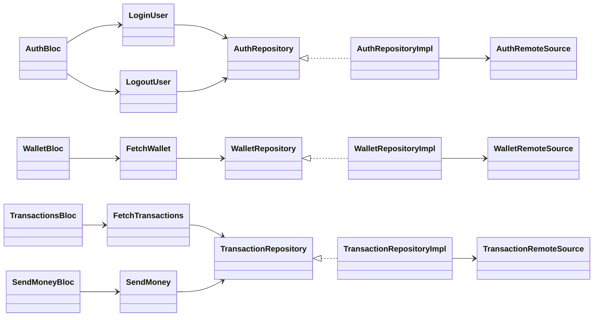
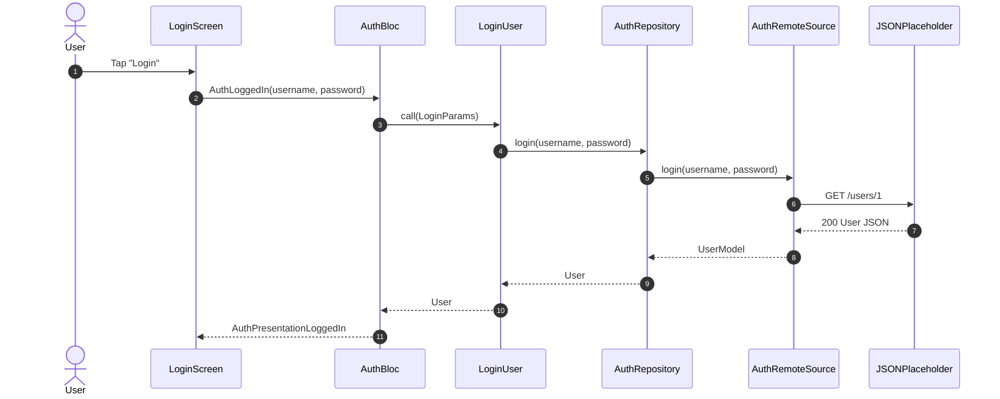
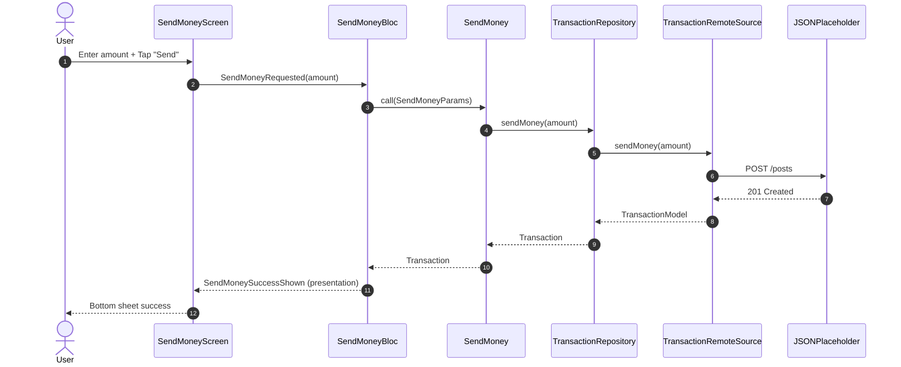

# Banking App (Send Money Demo)

Flutter demo app implementing a simple **Send Money** flow with:

- **Login**
- **Wallet** (balance + show/hide)
- **Send Money** (amount input + success/error bottom sheet)
- **Transaction History**

Tech:
- **Flutter**
- **Clean Architecture** (data, domain, presentation)
- **Bloc** (`flutter_bloc`) + `bloc_presentation` for one-off UI events
- **Dio** for API calls
- Fake API: `https://jsonplaceholder.typicode.com/`

---

## Requirements

- Flutter SDK installed (or use **FVM**)
- Dart comes with Flutter

Android-only:
- Android Studio (recommended) + Android SDK
- An Android emulator or physical Android device
- Run `flutter doctor -v` and ensure Android toolchain is OK

---

## Run the app (without FVM)

From the repo root:

```bash
flutter pub get
flutter run
```

### Choose a device (Android)

```bash
flutter devices
flutter emulators
flutter emulators --launch <emulator_id>
flutter run -d <device_id>
```

---

## Run the app (with FVM)

If you use [FVM](https://fvm.app/), install it first, then from the repo root:

```bash
fvm install
fvm flutter pub get
fvm flutter run
```
---

## Mock login credentials

This app uses a mock login flow (JSONPlaceholder user `id=1`).

- **Username**: `user`
- **Password**: `1234`

---

## Unit tests

This project includes unit tests per module under `test/`:

- `test/auth/` (AuthBloc state + presentation events)
- `test/wallet/` (WalletBloc)
- `test/transaction/` (SendMoneyBloc + TransactionsBloc)

### Run tests (without FVM)

```bash
flutter test
```

### Run tests (with FVM)

```bash
fvm flutter test
```

---

## API notes

This demo uses JSONPlaceholder:

- **Login user**: `GET /users/1`
- **Send money**: `POST /posts`
- **Fetch transactions**: `GET /posts`

Base URL is configured in:
- `lib/core/config/app_config.dart`

---

## Folder structure

```text
banking_app/
├─ android/
├─ assets/
│  └─ fonts/
├─ lib/
│  ├─ app.dart
│  ├─ main.dart
│  ├─ core/
│  │  ├─ config/
│  │  ├─ error/
│  │  ├─ extension/
│  │  ├─ network/
│  │  ├─ route/
│  │  └─ theme/
│  ├─ feature/
│  │  ├─ auth/
│  │  │  ├─ data/
│  │  │  ├─ di/
│  │  │  ├─ domain/
│  │  │  └─ presentation/
│  │  ├─ transaction/
│  │  │  ├─ data/
│  │  │  ├─ di/
│  │  │  ├─ domain/
│  │  │  └─ presentation/
│  │  └─ wallet/
│  │     ├─ data/
│  │     ├─ di/
│  │     ├─ domain/
│  │     └─ presentation/
│  └─ shared/
│     └─ component/
├─ test/
│  ├─ auth/
│  ├─ wallet/
│  └─ transaction/
├─ pubspec.yaml
└─ README.md
```

---

## Design documentation

### Architecture overview

Each feature follows Clean Architecture:

- **presentation**: UI + Bloc (state + events)
- **domain**: entities + repository contracts + use cases
- **data**: models + repository implementations + remote sources

Cross-cutting:
- `lib/core/`: config, routing, networking, theme, errors
- `lib/shared/`: reusable UI components

---

## Class diagram



---

## Sequence diagrams

### Login



### Send Money


